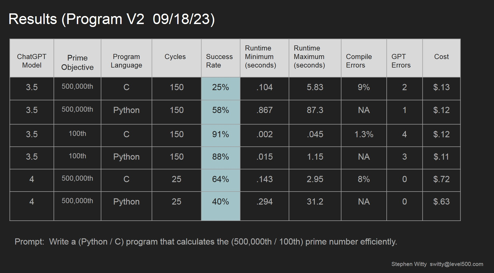

# AI C Gen
Docs 9-18-23 V2 (For questions or comments:  Stephen Witty switty@level500.com)  

### Project Overview:
This project forms a framework in which program algorithms in the form of source code can be requested from ChatGPT and then be automatically validated and scored.  The example provided in the project relates to prime numbers.  ChatGPT is asked to create a C or Python program in which the 500,000th prime number is determined.  The same request is made to ChatGPT over many iterations.  For each iteration, the source code is extracted from the ChatGPT reply and saved to disk.  The source code is then compiled (if needed) and run.  The output of the program is examined for the correct answer.  If the answer is correct, the running time of the program is stored and compared to other iterations.  The iteration that produces the correct prime number result in the shortest period of time is deemed to be the best.  Various stats are displayed as the test harness executes and a summary report is provided at program termination that displays the most favored algorithm.  

WARNING - A word of warning - The test harness directly executes source code provided by ChatGPT with no filtering.  The source code has the same ability as the user running the program.  For instance, it could delete the user's files.  In the future, with more powerful AI's this could also be a route to the loss of AI containment.  It is suggested for safety that the test harness is executed from a virtual machine with restrictions.

  

### Reports / Documentation:
- Raw logs that contain example runs can be found under Raw_Logs:
- [Raw Logs](https://github.com/switty42/AI_C_Gen/tree/main/Raw_Logs/091823)
- A presentation that covers the project can be found below:
- [Presentation Link](https://github.com/switty42/AI_C_Gen/blob/main/Presentations/AI_C_Gen_092223.pdf)

### Usage:

- The software is a Python3 script and runs in the usual manner
- The test harness is written in Python, but the example system is testing C or Python code produced by ChatGPT
- The test harness is written with Linux in mind, modifications would be needed for other OS(s)
- The cc compiler must be available if C is selected as the target language
- Python3 must be available if Python is selected as the target language
- There is only one Python source code/script file that forms the test harness
- A user must first install the OpenAI Python API (Google for instructions)
- User must enter their OpenAI API key toward the top of the Python script
- The GPT model can be selected in the source file
- Under Constants in the Python script - assign the number of times for the prompt to run
- The constant WORKING_DIR should be set to a directory used only by the test harness with no / on the end
- Under Constants select C or Python as the target language for testing
- The ChatGPT prompt can be adjusted as needed under Constants
- Specify successful execution as a string inside of ANSWER and ANSWER2
- If there is only one answer duplicate both
- A time limit is placed on each running C program to prevent infinite loops